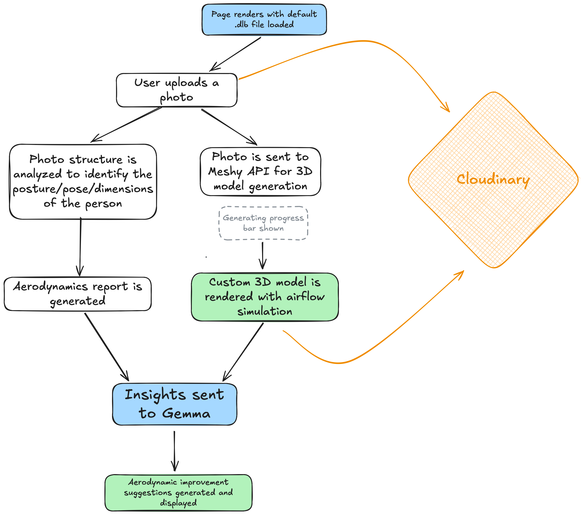
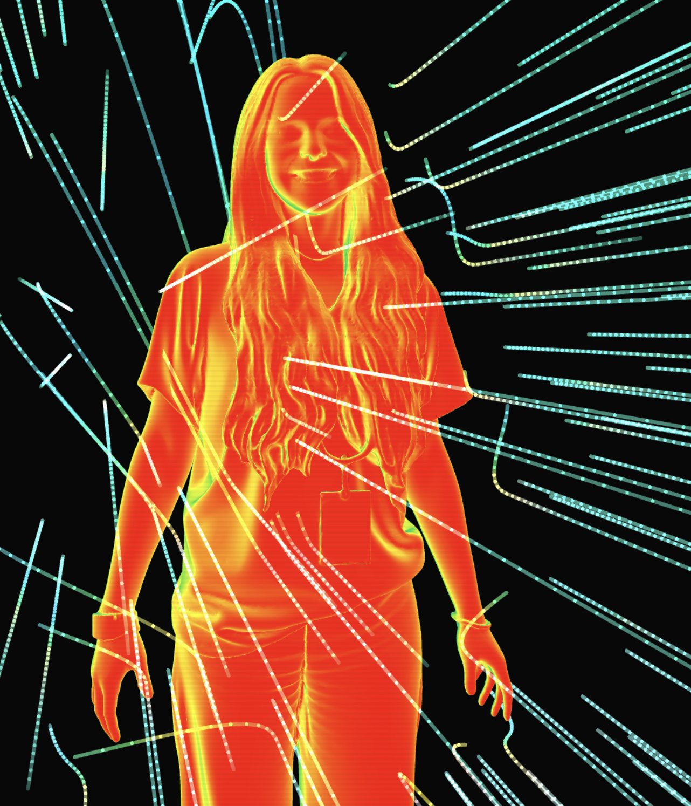

# AeroMaxx

**Looksmaxx your aerodynamics. Streamline your life.**

---

## What is this?

Looksmaxxing is the practice of optimizing every measurable aspect of your physical presentation, popularized by Clavicular, a streamer. Most people focus on skin, hair, jaw. 

**We focus on drag coefficient. Looksmaxx your aerodynamics. Streamline your life.**

1. Upload a photo.
2. Your stance gets analyzed -- 2D numbers are extracted and crunched while a 3D model with aerodynamic drag visualized and simulated in real-time is generated. 
3. Nothing is hardcoded. Your photo generates real physics data with insights for how the calculations were formed.
4. A real, interactive, 3D aerodynamic model is generated from your uploaded photo with extensive detail. You can rotate and observe the aerodynamic flow around your form in the 3D viewer.
5. All of this 3D and 2D analysis data is given to Google Gemma, who provides you with a personalized drag reduction protocol — specific exercises, posture corrections, and clothing changes — ranked by projected percentage improvement to your Cd.

The average person wastes **hundreds of Big Macs worth of energy** fighting air resistance over a lifetime. AeroMaxx quantifies exactly how much, and tells you what to do about it.

---

## Stack

| Layer | Technology |
|---|---|
| Frontend | React + TypeScript (Vite) |
| 3D Rendering | Three.js — custom GLSL CFD shader, Line2 streamlines |
| Pose Estimation | MediaPipe Tasks Vision — `PoseLandmarker` (GPU delegate) |
| 3D Reconstruction | Meshy AI image-to-3D (`meshy-6`) |
| AI Analysis | Google AI Studio — `gemma-4-31b-it` via OpenAI-compat endpoint |
| Asset Storage | Cloudinary (images + GLBs) |
| Drag Physics | Hoerner (1965) + Kyle & Burke (1984) empirical constants |

**Complexity highlights:**
- Zero-allocation per-frame streamline animation — directly mutates Line2's internal `InterleavedBuffer` to avoid GC pressure on 280 concurrent trails
- Dual async pipeline (pose + 3D generation) with a synchronization gate before analysis is revealed
- World-space CFD normal shader that's camera-independent — pressure colors stay fixed as you orbit
- MediaPipe GPU-delegate inference running directly on an offscreen `HTMLCanvasElement`

---

## Logic Flow



---

### 1. Page renders with default `.glb` file loaded

<br/>
*The default model is a `.glb` file from [this repo](https://github.com/hmthanh/3d-human-model/tree/main)*

`ModelViewer.tsx` initializes a Three.js `WebGLRenderer`, `PerspectiveCamera`, and `OrbitControls`. `GLTFLoader` fetches `/default-human2.glb` from the Vite dev server's static assets. Once loaded, a `Box3` bounding box is computed, the mesh is scaled so its tallest axis = 2.0 world units, and a custom `ShaderMaterial` is applied across all child `Mesh` objects.

The vertex shader computes `vWorldNormal = normalize(mat3(modelMatrix) * normal)` in world space. The fragment shader maps the Z component of that normal to a pressure color: `pressure = vWorldNormal.z`, then linearly interpolates through red → orange → yellow → green → blue → navy across the range `[-1, 1]`.

280 streamlines are spawned as `Line2` objects with `AdditiveBlending`, each advancing at `WIND_SPEED = 0.022` units/frame, deflected by an ellipsoidal body proxy using normalized distance `eDist = sqrt((dx/rx)² + (dy/ry)² + (dz/rz)²)`.

---

### 2. User uploads a photo → Cloudinary

The Cloudinary Upload Widget (loaded via CDN script tag) opens. On success it returns `secure_url` — a Cloudinary-hosted JPEG/PNG URL. Simultaneously two async pipelines fire.

---

### 3. Left branch — MediaPipe pose analysis

The image is drawn onto an offscreen `HTMLCanvasElement`. `@mediapipe/tasks-vision` `PoseLandmarker` runs inference (GPU delegate via WebGL) on the canvas pixel data, returning 33 normalized landmarks `{x, y, z}` in `[0,1]` image space. Key indices extracted: `0` (nose), `11/12` (shoulders), `23/24` (hips), `27/28` (ankles).

Pixel distances computed as `dist = sqrt(((ax-bx)*W)² + ((ay-by)*H)²)`. Body height in pixels = nose → ankle midpoint Euclidean distance. Scale factor: `pixelsPerMeter = bodyHeight / 1.7526` (standardized 5′9″). Real-world measurements derived: `realShoulderWidth = shoulderWidthPx / pixelsPerMeter`. Hunch score: `|shoulderMidX - hipMidX| / (shoulderWidth * 0.3)`, clamped `[0,1]`.

Those landmarks are then drawn back onto the canvas as green skeleton lines + labeled dots and exported as a base64 JPEG via `canvas.toDataURL()`.

<br/>
*Of MediaPipe's 33 landmarks, AeroMaxx uses 9 for measurement: nose (0), left/right shoulder (11, 12), left/right hip (23, 24), and left/right ankle (27, 28). Elbow (13, 14), wrist (15, 16), and knee (25, 26) are drawn in the skeleton overlay but not used for drag calculation.*

**Drag physics** (`drag.ts`): `F = ½ρv²CdA` where `ρ = 1.225 kg/m³`, `v = 1.4 m/s`. Without GLB, `A = realShoulderWidth × 1.75 × 0.73` (0.73 = Kyle & Burke 1984 fill factor). Base `Cd = 0.80` (Hoerner 1965). Postural penalty: `hunchScore × 0.08` Cd units. Lifetime energy: `F × v × 4 hr/day × 3600 × 365 × 75 yr` joules.

---

### 4. Right branch — Meshy 3D generation

The Cloudinary image is fetched, converted to a base64 data URI, and POSTed to `https://api.meshy.ai/openapi/v1/image-to-3d` with `{model: "meshy-6", symmetry_mode: "on", enable_pbr: false}`. Meshy returns a `task_id`. Polling hits `GET /openapi/v1/image-to-3d/{taskId}` every 3 seconds, reading `task.progress` until `status === "SUCCEEDED"`. Returns a signed `assets.meshy.ai` GLB URL.

That URL is proxied through Vite (`/meshy-assets → https://assets.meshy.ai`) to bypass CORS, fetched as a blob, and uploaded to Cloudinary via `POST /v1_1/{cloud}/raw/upload` with `resource_type: raw` for persistent storage.

<br/>
*Meshy image generation takes 120–180 seconds, but the detail is pretty good. In this image, it detected my lanyard, bracelet, and wristband correctly.*

---

### 5. GLB loads in viewer + geometry measurement

`GLTFLoader` fetches the Cloudinary GLB URL. On load, `Box3.setFromObject()` computes the tight axis-aligned bounding box. `size.x` = shoulder width, `size.z` = front-to-back depth, both in normalized world units. Real measurements: `realWidth = (size.x / size.y) × 1.7526`. `frontalArea = realWidth × 1.7526 × 0.73`. `depthToWidthRatio = realDepth / realWidth`.

Cd corrections applied: if `ratio < 0.35`, flat-body penalty `+= (0.35 - r) × 0.40`; if `ratio > 0.70`, deep-body penalty `+= (r - 0.70) × 0.20`. `onGeometryMeasured` callback fires, storing `GlbMeasurements` and triggering the Gemma gate.

---

### 6. Insights sent to Gemma

`tryRunGemma()` checks that both `poseDataRef` and `glbReadyRef` are non-null — only then fires. Recalculates drag with the richer 3D `A` value. POSTs to `https://generativelanguage.googleapis.com/v1beta/openai/chat/completions` with `model: "gemma-4-31b-it"`, passing the full numeric profile (Cd, A, hunch score, postural penalty, shoulder-to-hip ratio, lifetime joules) as the user message. `temperature: 0.3`, `max_tokens: 500`. Response is stripped of any `<thought>...</thought>` block via regex before display.

---

## Running locally

```bash
cp .env.example .env
# fill in VITE_CLOUDINARY_*, VITE_MESHY_API_KEY, VITE_GEMINI_API_KEY
npm install
npm run dev
```

---

*Built for LAHacks 2026 by [Karolina Dubiel](https://linkedin.com/in/karolinadubiel)*
